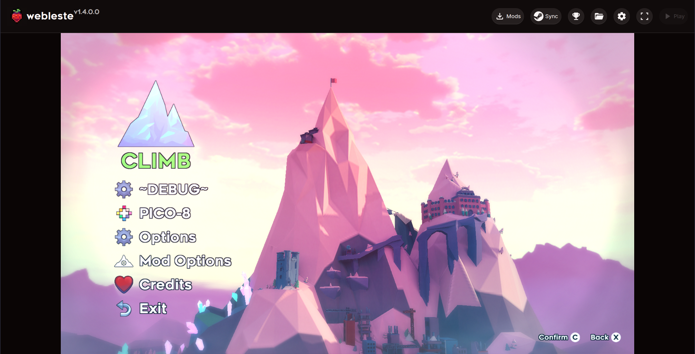

<h1>Webleste</h1>

 

A mostly-complete port of Celeste (2018) to WebAssembly using dotnet 9's threaded WASM support and [FNA WASM libraries](https://github.com/r58playz/FNA-WASM-Build).

<i>Strawberry Jam</i> running in Webleste

## Limitations

- Loading the game consumes 600M or so of memory, which is still around 3x lower than the original port, but it is still too much for low end devices.
- You may encounter issues on firefox.

## I want to build this

1. Ensure node and pnpm exist and `pnpm i`
2. Install dotnet 9.0.4
3. Install the mono-devel package on your distro
4. run `sudo dotnet workload restore` in the loader dir
5. run `make serve` for a dev server and `make publish` for a release build

## I want to port this to a newer version of celeste (once it exists)

1. fix any issues with the hooks
2. make a pr!

## I want to figure out how this works

- The native dotnet WASM support is used to compile a loader program to WASM
  - `celeste/Program.cs` loads a patched Celeste assembly and exports a function that polls its main loop
  - `celeste/Patcher.cs` runs MonoMod on celeste assemblies provided by the user to patch it for WASM
  - `patcher/` has the source for the `MonoMod.Patcher` mod used for WASM patches
- A WASM port of MonoMod is used to provide detours/hooks to Everest and other runtime mods, it functions completely on the IL level and is mono specific
- FMOD pthread builds are used for audio, with slight patching of the bindings so that using FMOD 2 works
- The game canvas is transferred to dotnet's "deputy thread" and all rendering is done from there through FNA's OpenGL driver
